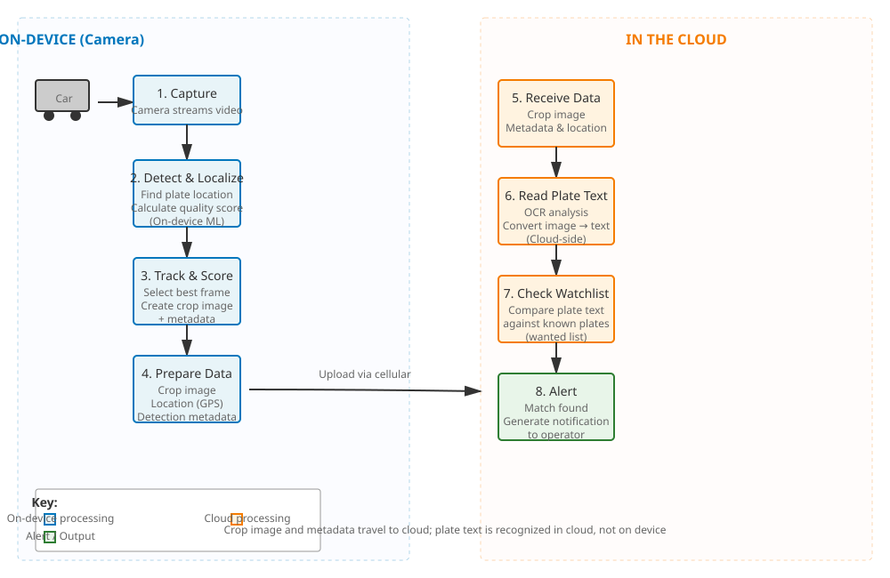
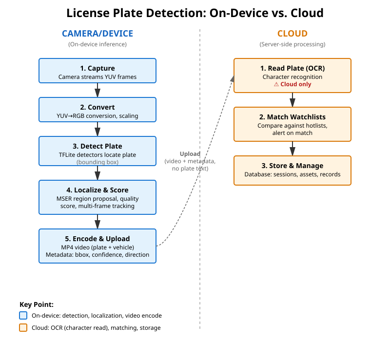
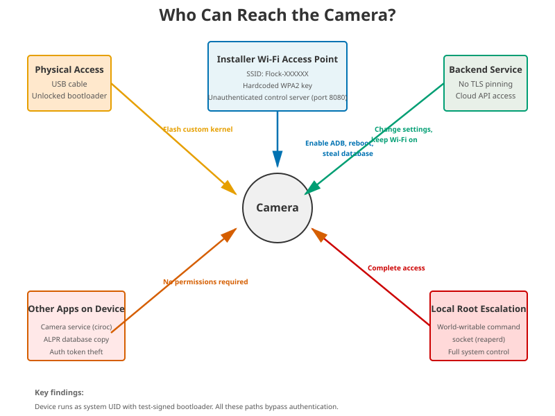

# Start here

Flock Safety cameras are the black boxes bolted to poles along many roads. They photograph every vehicle that drives past and read its license plate. This wiki takes one of those cameras apart — not with a screwdriver, but by reading its **firmware** (the software built into the device) — to show what it actually does and where it is weak.

Everything here comes from a public leak of that firmware. All of it was studied by reading code and files, a method called **static analysis**. No real camera was switched on, and no Flock server was ever contacted. Hostnames and secret values are blacked out throughout.

If you read nothing else, read the four explainers below. Each is written for a general audience. The diagrams show the big picture first.

## The big picture, in three diagrams

The camera splits its work between the device on the pole and Flock's servers in the cloud. This first diagram traces how a captured vehicle flows from one to the other.

One split matters more than any other. The camera **finds** the plate in the picture by itself, but it does not read the numbers on the pole. Reading the characters — a step called **OCR** (Optical Character Recognition, turning a picture of text into actual letters and numbers) — happens later, on Flock's servers. The device sends a cropped photo of the plate; the cloud figures out what it says.

Finally, a camera on a public pole can be reached in more ways than you might expect. This diagram shows every path someone could use to control it or pull data out of it — from plugging in a USB cable to talking to the camera over its own setup Wi-Fi.

## The four explainers

Read these in order, or jump to whichever question you have.

- **[What these cameras are and what they do](explainer-overview.md)** — A box on a pole that runs Android and photographs every car that passes, not just cars on a wanted list. Start here if you want the plain overview.
- **[How the camera spots and reads license plates](explainer-how-it-reads-plates.md)** — The two-step trick: the camera locates the plate on the pole, but the cloud reads the numbers.
- **[What the camera collects and sends](explainer-what-it-collects.md)** — The exact list of details logged for each vehicle — time, location, color, shape — and what leaves the device.
- **[The security problems, in plain terms](explainer-security.md)** — The locks that don't lock: encrypted video with the key taped right beside it, and a startup process that trusts practice keys anyone can copy.

## What the study found, in one breath

Four findings anchor the rest of this wiki:

- **The plate number is read in the cloud, not on the camera.** The device detects and locates plates and scores their quality, but it never produces the plate text and never stores it. See [How it reads plates](explainer-how-it-reads-plates.md).
- **It logs structured details for every vehicle** — a tidy record per capture with things like time, a vehicle category, a confidence score, and where the plate sits in the frame. See [What it collects](explainer-what-it-collects.md).
- **The saved video is encrypted, but the key is left in the clear** — sitting in plain view right next to the locked files, like taping the key to the safe. Anyone holding the device can unlock the footage. See [Security problems](explainer-security.md).
- **The device's startup is test-signed** — it trusts generic practice keys instead of Flock's own, which weakens the guarantee that only genuine software runs on it. See [Security problems](explainer-security.md).

## For the technically inclined

If you want the code-level detail, the full wiki index lives at **[Home](Home.md)**. The notes that back the explainers above:

- **[Security posture](security-posture.md)** — every confirmed finding, ranked by severity.
- **[ALPR pipeline](alpr-pipeline.md)** — the capture-to-cloud stages, including where OCR is and is not.
- **[Data & storage](data-and-storage.md)** — how the device stores video, what is encrypted, and the key-handling flaw.
- **[Backend protocol](backend-protocol.md)** — how the camera talks to Flock's servers and what each capture transmits.
- **[Boot chain](boot-chain.md)** — how the device starts up and why its test-signed trust chain matters.
- **[Local attack surface](local-attack-surface.md)** — the parts of the device other apps, an installer, or a passer-by can reach.
- **[ML models](ml-models.md)** — the on-device neural networks that detect plates and vehicles.

Two short pages set the ground rules for the whole project: **[Claims vs evidence](claims-vs-evidence.md)** tests Flock's public statements against the firmware, and the **[Glossary](glossary.md)** defines the technical terms in plain language.

---
*Scope: static analysis of a public firmware leak. Structure and behavior only — no personal data, no captured media, and no secret values are published here.*
